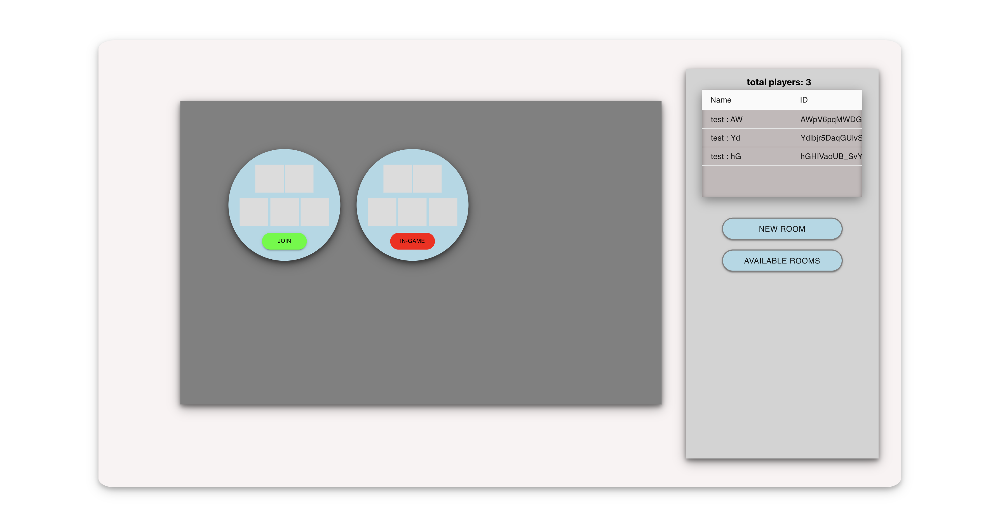
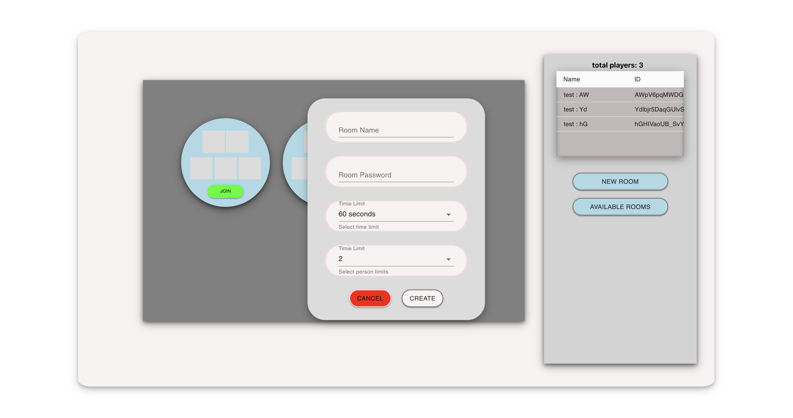
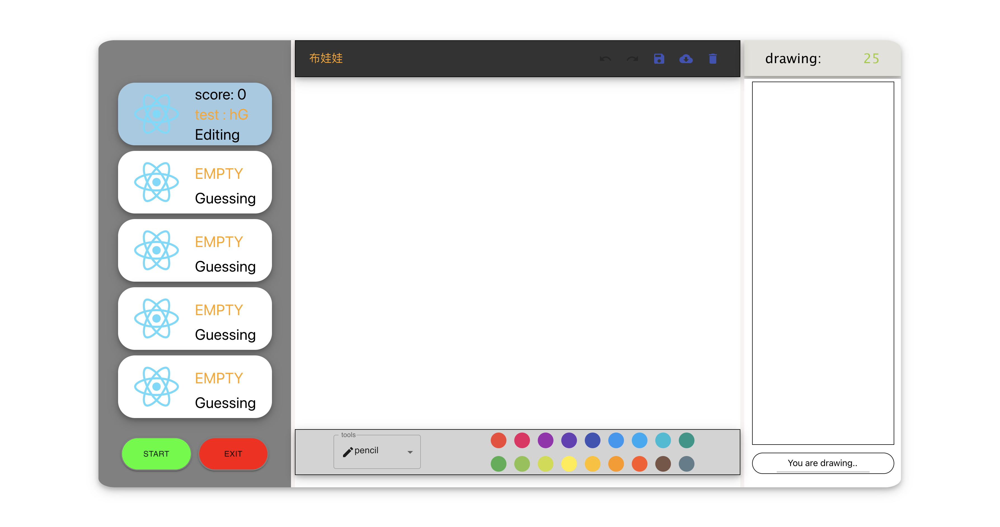

# DrawSomething

  <pre> 
  &nbsp players take turns drawing a picture to convey the guess word for their partner to guess.
  The person drawing is provided random words, and he/she needs to draw the word out and the
  other player should guess. If they guess correct, they will get the points.</pre>

# Project Screen Shots
- **Lobby**
 </img>
- **Create Room**
 </img>
- **In Game**
 </img>
# Tech/framework used

- react
- redux && react-redux && redux-thunk
- socket-io
- async && wait

# Installation and Setup Instructions

### client

- **Example:**  
  <pre>Clone down this repository. You will need node and npm installed globally on your machine.
- **Installation:**  
  <pre>cd client && npm install
- **Installation:**  
  <pre>npm start

### server
  - **Installation:**  
  <pre>cd server && npm install </pre>
  - **Installation:**  
  <pre>npm start </pre>

## Live demo
<pre> https://dazzling-jang-9f660f.netlify.app </pre>
